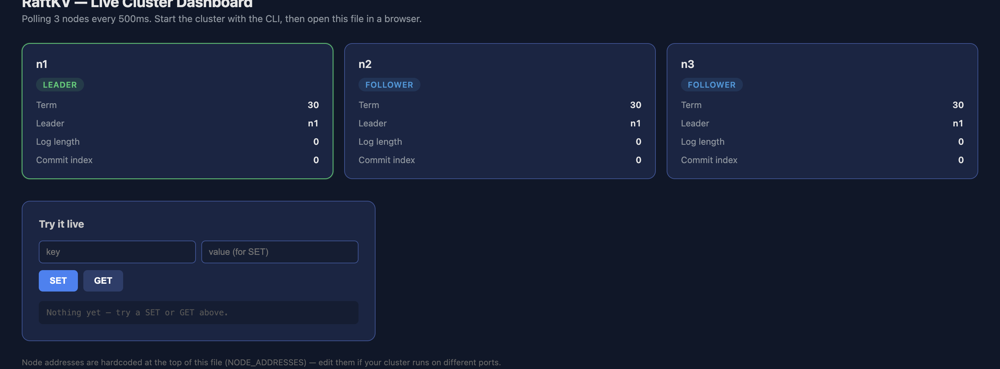
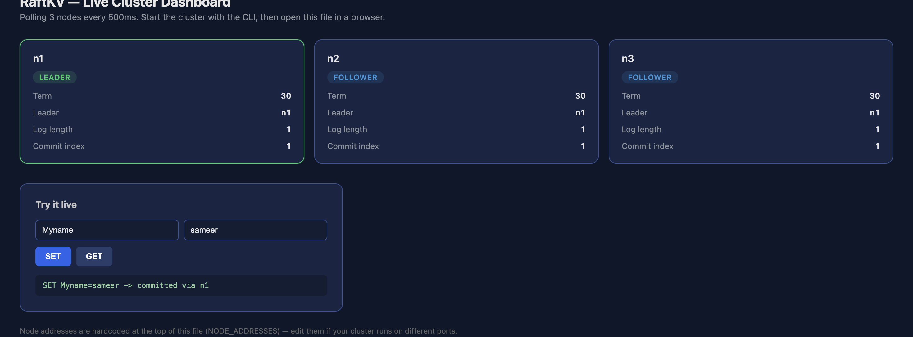
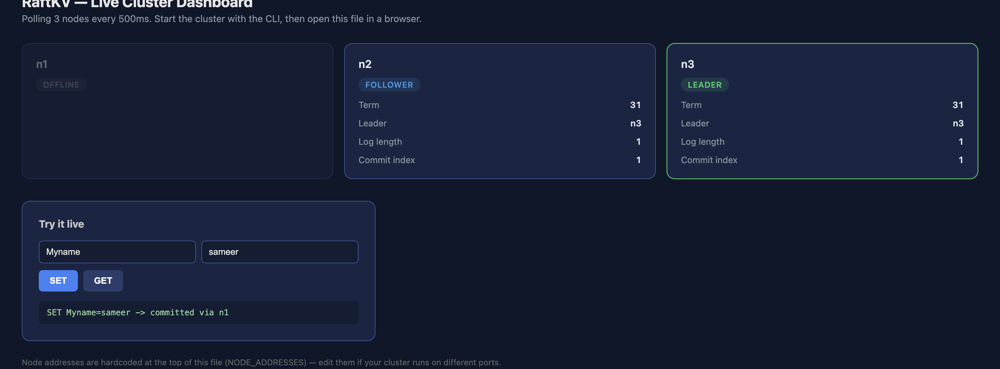
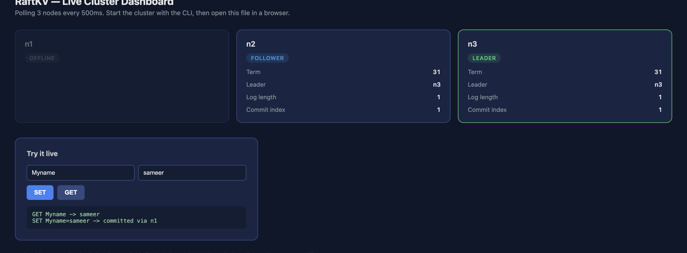

# RaftKV

[](https://python.org)
[](#quick-start)
[](#testing)
[](LICENSE)

A distributed key-value store built on a from-scratch implementation of the
[Raft consensus algorithm](https://raft.github.io/raft.pdf) (Ongaro &
Ousterhout, 2014) — the same algorithm behind etcd (which powers
Kubernetes), CockroachDB, and Consul. Three nodes agree on a replicated,
ordered log and stay consistent even when nodes crash, restart, or the
network partitions. Zero external dependencies — pure Python stdlib.

> Every piece — leader election, log replication, crash-safe persistence,
> and the fault-injection tests that verify all of it — is implemented
> here, not delegated to a consensus library.

---

## Why this project

Distributed consensus is one of the genuinely hard, foundational problems
in systems engineering — it's the reason MIT's graduate distributed
systems course (6.824) uses building Raft as its flagship assignment.
Building one teaches:

- **Distributed agreement under failure** (leader election, quorum/majority commit)
- **Crash safety** (atomic persistence, log replay on restart)
- **Concurrency correctness** (lock discipline across network calls — see [bugs found](#bugs-found-and-fixed) below)
- **Fault-injection testing** (killing processes and partitioning networks on purpose, not just happy-path tests)

This isn't a tutorial reimplementation — it's the reliability engine
underneath every "3-node cluster" a real backend team runs, scaled down to
one laptop.

---

## Architecture

```
Client
  │  SET / GET / DELETE
  ▼
┌─────────────────────┐
│      KVClient        │   finds current leader, retries on redirect
└──────────┬───────────┘
           │ HTTP
           ▼
┌─────────────────────────────────────────────┐
│               RaftServer (× 3 nodes)          │
│  ┌─────────────┐  ┌──────────────────────┐   │
│  │  RPC Layer   │  │      RaftNode         │   │
│  │ (stdlib HTTP)│◄─┤  election · replication│  │
│  └─────────────┘  │  commit rule · persistence│
│                    └───────────┬──────────┘   │
│                                ▼               │
│                    ┌──────────────────────┐   │
│                    │   KVStateMachine      │   │
│                    │  (applies committed   │   │
│                    │   entries to a dict)  │   │
│                    └──────────────────────┘   │
└─────────────────────────────────────────────┘
```

**Write flow:** client → leader appends to its log → leader replicates to
followers via `AppendEntries` → once a **majority** acknowledge, the entry
commits → committed entries are applied to each node's local key-value
store, in the same order, everywhere.

---

## Core mechanisms

| Mechanism | What it does | Where |
|---|---|---|
| **Leader election** | Randomized timeouts prevent split-vote livelock; term tracking ensures only one leader per term | `raftkv/node/raft.py` |
| **Log replication** | `AppendEntries` RPC with conflict detection + fast backtracking (skips straight to the right index instead of decrementing one-by-one) | `raftkv/node/raft.py` |
| **Crash-safe persistence** | Atomic write-to-tmp-then-rename, `fsync`'d before responding to any RPC that depends on it | `raftkv/storage/persistence.py` |
| **Network partition simulator** | Deterministically splits the cluster into isolated groups for testing — same technique MIT 6.824's own test suite uses | `raftkv/rpc/network_sim.py` |
| **KV state machine** | Applies committed log entries to an in-memory store, in commit order | `raftkv/kv/state_machine.py` |

---

## Bugs found and fixed

Fault-injection testing surfaced two real bugs — not synthetic examples,
found by actually breaking the running system.

### 1. Lock held across blocking network calls (concurrency bug)

The election-timer loop called into the election logic **while still
holding the node's lock**, which included sequential blocking RPC calls to
every peer (up to 0.5s timeout each). This prevented the node from
responding to incoming votes from other nodes during its own election
attempt, occasionally stalling majority-side re-election for 3+ seconds
after a partition.

**Fix:** release the lock before making any network calls.

| | Before | After |
|---|---|---|
| Re-election time (avg) | occasionally 3,000+ ms | **5.9 ms** |
| Re-election success rate (8 trials) | 7/8 | **8/8** |

### 2. Stale-read race on the client

`KVClient.get()` defaulted to querying nodes in a fixed order, ignoring
which node was the last known leader. Right after a write, a `GET` could
hit a follower that hadn't yet applied that specific entry, or — after a
leader crash — hit the now-dead old leader with no fallback.

**Fix:** `get()` now prefers the last-known leader first, then falls back
across every other node in the cluster.

---

## Benchmarks

All measured on a 3-node localhost cluster.

### Write throughput (full consensus + replication path)

| Metric | Value |
|---|---|
| Throughput | **38.9 ops/sec** |
| p50 latency | 25.7 ms |
| p95 latency | 27.3 ms |
| p99 latency | 28.6 ms |

### Leader re-election after crash

| Metric | Value |
|---|---|
| Avg | **5.9 ms** |
| Max | 8.5 ms |
| Success rate | 5/5 trials |

### Read throughput (served locally, no consensus round-trip)

| Metric | Value |
|---|---|
| Throughput | **2,195 ops/sec** |

### Before/after: immediate replication on write

One concrete fix — triggering replication immediately on write instead of
waiting for the next periodic heartbeat tick — doubled write throughput:

| Metric | Before | After | Delta |
|---|---|---|---|
| Throughput | 19.6 ops/sec | **38.9 ops/sec** | **+98%** |
| p99 latency | 67.7 ms | 28.6 ms | **-58%** |

Full benchmark suite in `tests/benchmark.py`.

---

## Fault-injection tests

Three scenarios, run against real threads and real sockets on localhost —
not mocked:

| Scenario | Verifies |
|---|---|
| **Leader crash mid-operation** | New leader elected, zero data loss, writes continue |
| **Network partition** | Minority side (incl. stale old leader) blocked from committing; majority elects its own leader and keeps working |
| **Crashed node restart** | Node correctly catches back up via replication after rejoining |

```
python -m tests.fault_injection
```

---

## Quick start

Requirements: Python 3.11+. No other dependencies — no pip install, no API keys, no Docker.

```bash
git clone https://github.com/sameer-sde/raftKv
cd raftKv

python3 -m venv venv
source venv/bin/activate

# Instant in-process demo (election, writes, leader-crash failover)
python main.py demo
```

For a real multi-process cluster, open 3 terminals:

```bash
# Terminal 1
python main.py node --id n1 --port 8001 --peers n2=localhost:8002,n3=localhost:8003

# Terminal 2
python main.py node --id n2 --port 8002 --peers n1=localhost:8001,n3=localhost:8003

# Terminal 3
python main.py node --id n3 --port 8003 --peers n1=localhost:8001,n2=localhost:8002
```

Then, from a 4th terminal:

```bash
python main.py client set hello world --cluster n1=localhost:8001,n2=localhost:8002,n3=localhost:8003
python main.py client get hello --cluster n1=localhost:8001,n2=localhost:8002,n3=localhost:8003
```

Kill whichever terminal shows `role=leader` — the cluster elects a new
leader within milliseconds, and the `client` commands keep working.

### Live dashboard

Once the cluster is running (via the 3-terminal setup above), open
`dashboard/index.html` directly in a browser — no build step, no npm
install. It polls all 3 nodes every 500ms and shows live role/term/log
state, plus a SET/GET panel to interact with the cluster directly:

```bash
open dashboard/index.html   # macOS
```

Kill a leader from its terminal and watch the dashboard flip to the new
leader in real time.

### Proof: live failover, captured end-to-end

These are real screenshots from an actual running cluster on a laptop —
not mockups. Together they show the full sequence: a healthy cluster, a
write committing across it, the leader crashing mid-session, and the data
still being there once a new leader takes over.

**1. Healthy cluster** — all 3 nodes online, `n1` elected leader, nothing
written yet:



**2. A write commits across the cluster** — `SET Myname=sameer` replicates
and commits on all 3 nodes at once (log length and commit index jump from
0 to 1 everywhere):



**3. The leader is killed mid-session** — `n1` goes offline, and `n3` is
automatically elected the new leader at a higher term, with zero manual
intervention:



**4. The data survived** — `GET Myname` still returns `sameer` through the
new leader, proving zero data loss across the crash:



---

## Testing

```bash
# Unit tests (17 tests, pure logic, no sockets)
python -m unittest tests.test_raftkv -v

# Fault injection (real sockets, real threads, ~10s)
python -m tests.fault_injection

# Benchmarks
python -m tests.benchmark
```

---

## CLI reference

| Command | Purpose |
|---|---|
| `main.py node --id <id> --port <port> --peers <id=host:port,...>` | Run a single node process |
| `main.py client set <key> <value> --cluster <id=host:port,...>` | Write a key through the cluster |
| `main.py client get <key> --cluster <id=host:port,...>` | Read a key from the cluster |
| `main.py client delete <key> --cluster <id=host:port,...>` | Delete a key |
| `main.py demo` | Instant in-process 3-node demo, no setup |

---

## Known simplifications

Documented deliberately, not oversights:

- **Reads can hit any node**, including followers, so a read can be
  slightly stale if it hits a follower mid-replication. Production Raft
  systems solve this with "read index" or lease-based reads.
- **No log compaction/snapshotting** — the log grows unbounded. A natural
  next extension.
- **Network partitioning uses a simulator**, not real network tooling
  (iptables/tc), since all nodes run on localhost — standard practice for
  deterministic Raft testing (used by MIT 6.824's own suite).

---

## Repository layout

```
raftkv/
├── raftkv/
│   ├── node/          # RaftNode (election + replication), RaftServer
│   ├── rpc/            # HTTP transport, message types, network simulator
│   ├── storage/        # Crash-safe disk persistence
│   └── kv/              # KVStateMachine + KVClient
├── dashboard/
│   ├── index.html       # Live cluster dashboard (React via CDN, zero build step)
│   └── screenshots/      # Proof screenshots referenced in this README
├── tests/
│   ├── test_raftkv.py        # 17 unit tests
│   ├── fault_injection.py     # 3 live-cluster fault scenarios
│   ├── cluster_helper.py      # Test cluster helper
│   └── benchmark.py           # Throughput/latency/election-time benchmarks
├── main.py              # CLI: run nodes, run a client, or an in-process demo
└── requirements.txt      # Empty on purpose — stdlib only
```

---

## What I'd build next

- **Log compaction / snapshotting** — bound the log's growth for long-running clusters
- **Read-index or lease-based reads** — linearizable reads from any node, not just the leader
- **Membership changes** — add/remove nodes from a live cluster without downtime
- **Real network partitioning** in the dashboard (visualize/trigger it from the UI, not just the CLI test suite)

---

## Acknowledgments

Built as a from-scratch study of distributed consensus. Primary reference:
[the Raft paper](https://raft.github.io/raft.pdf) (Ongaro & Ousterhout,
2014) and MIT 6.824's public lecture materials on Raft testing methodology.
